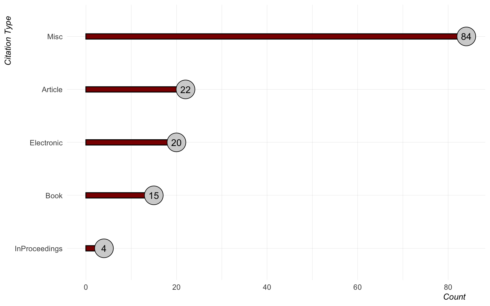
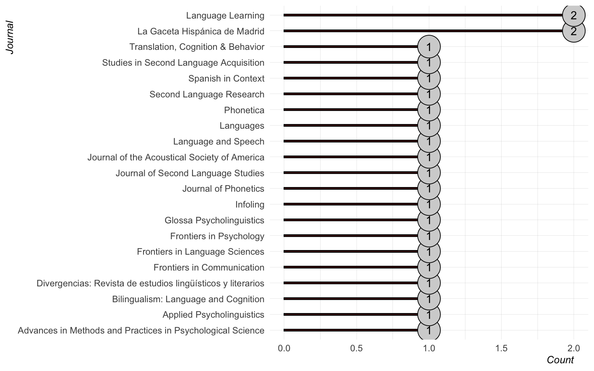
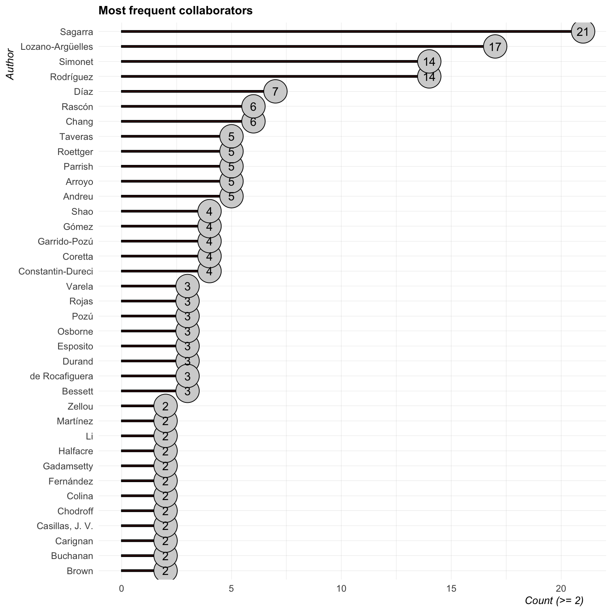
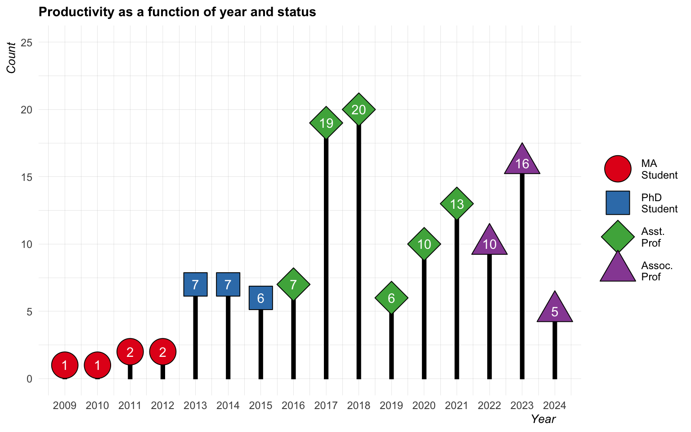
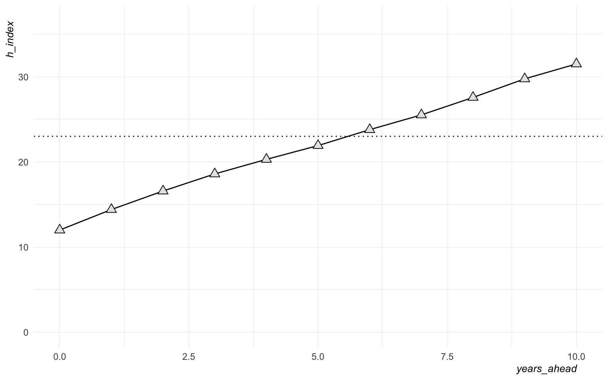
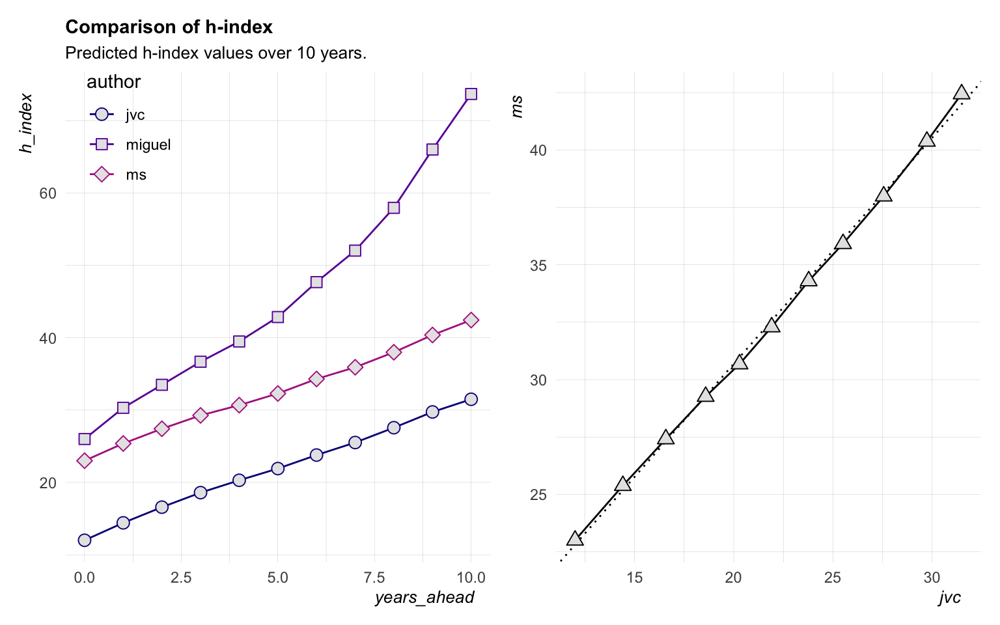
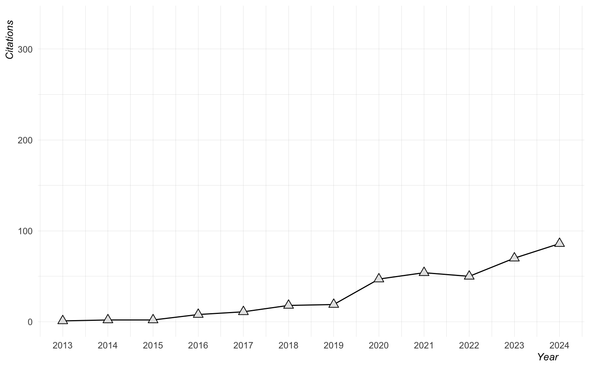
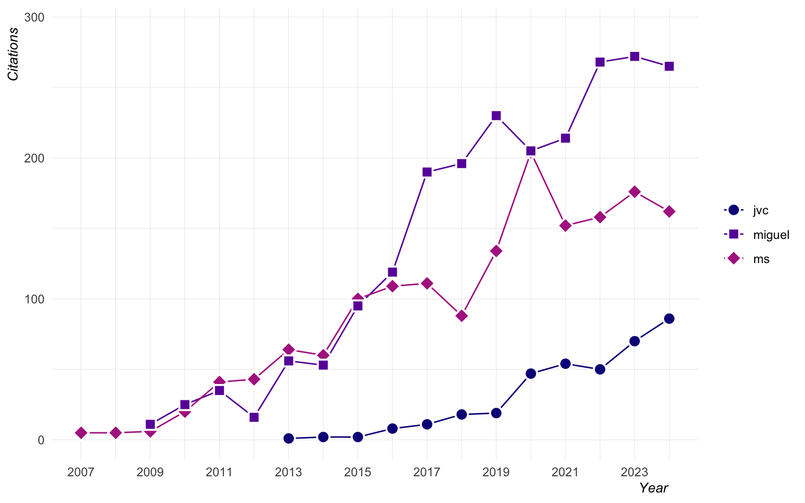

# mybib

Version controlled .bib file for my articles, proceedings,
presentations, posters, and workshops.

This is a ‘clean’ version. It only contains UTF-8 chars (i.e.  no
`tipa`).

This is **NOT** synchronized with my online CV (for the TODO list).

-----

Last Updated: 2019-12-04 19:41:38

License: Public Domain (CC-0)

I am still testing this. Initial commit is a direct copy of example done
by [leeper](https://github.com/leeper/references).

Here are some basic statistics on its contents:

``` r
bib <- suppressWarnings(ReadBib(here("publications_html.bib"), 
                                check = FALSE))


dat <- bib %>% 
  as_tibble(.) %>% 
  map_df(.f = HTMLdecode) %>% 
  mutate(year = as.numeric(year))
```

## Citation Types

``` r
counts <- xtabs(~bibtype, data = bib) %>% as_tibble

counts %>% 
  mutate(., bibtype = fct_reorder(bibtype, n)) %>% 
  ggplot(., aes(x = bibtype, y = n, label = n)) + 
    geom_bar(stat = 'identity', color = 'black', 
             fill = 'darkred', width = 0.1) + 
    geom_point(pch = 21, size = 10, color = 'black', fill = 'lightgrey') + 
    geom_text() + 
    labs(y = "Count", x = "Citation Type") + 
    coord_flip() + 
    my_theme()
```



## Journals

``` r
datj <- aggregate(bibtype ~ journal, data = bib, FUN = length)

dat %>% 
  group_by(., journal) %>% 
  summarize(., counts = n()) %>% 
  na.omit() %>% 
  mutate(., journal = fct_reorder(journal, counts)) %>% 
  ggplot(., aes(x = journal, y = counts, label = counts)) + 
    geom_bar(stat = "identity", color = 'black', 
             fill = 'darkred', width = 0.1) + 
    geom_point(pch = 21, size = 10, color = 'black', fill = 'lightgrey') + 
    geom_text() + 
    labs(y = "Count", x = "Journal") + 
    coord_flip() + 
    my_theme()
```



## Authors

``` r
# Initialize list
authors <- list()

# For each element in list, get last name of author and store in 
# 'authors' list
for (i in 1:length(bib)) {
  authors[[i]] <- bib[i]$author$family %>% unlist(.)
}

# Convert to tibble and plot
map(authors, HTMLdecode) %>% 
  unlist(.) %>% 
  enframe(.) %>% 
  group_by(., value) %>% 
  summarize(., counts = n()) %>% 
  mutate(., value = fct_reorder(value, counts)) %>% 
  ggplot(., aes(x = value, y = counts, label = counts)) + 
    geom_bar(stat = "identity", color = 'black', 
             fill = 'darkred', width = 0.1) + 
    geom_point(pch = 21, size = 10, color = 'black', fill = 'lightgrey') + 
    geom_text() + 
    labs(y = "Count", x = "Author") + 
    coord_flip() + 
    my_theme()
```



## Publication Years

``` r
prod <- dat %>% 
  select(., year) %>% 
  na.omit(.) %>% 
  group_by(., year) %>% 
  summarize(., counts = n()) %>% 
  ungroup(.) %>% 
  mutate(., status = if_else(year <=2012, 'MA\nStudent', 
                             if_else(year <=2016, 'PhD\nStudent', 
                                     'Asst.\nProf')), 
            status = fct_relevel(status, 
                                 c('MA\nStudent', 'PhD\nStudent', 
                                   'Asst.\nProf')))

year_max <- max(prod$counts)
year_current <- prod$year %>% unique %>% max

prod %>% 
  ggplot(., aes(x = year, y = counts, label = counts)) + 
    geom_bar(stat = "identity", color = 'black', 
             fill = 'black', width = 0.1) + 
    geom_point(aes(shape = status, fill = status), size = 10, color = 'black') + 
    scale_shape_manual(name = '', values = 21:23) + 
    scale_x_continuous(breaks = seq(2009, year_current, 2)) + 
    geom_text(color = 'white') + 
    scale_fill_brewer(name = '', palette = 'Set1') + 
    labs(y = "Count", x = "Year", 
         title = "Productivity as a function of year and status") + 
    expand_limits(y = c(0, year_max + 5)) + 
    my_theme()
```



# Google scholar data

## H-index stuff

``` r
# Include ID
my_id <- "6sd7cVAAAAAJ"
ms_id <- "GnYMTI8AAAAJ"

# Get h-index and citation history
my_h <- predict_h_index(my_id) %>% mutate(author = "jvc")
my_c <- get_citation_history(my_id) %>% mutate(author = "jvc")

# Game same info for MS
ms_h <- predict_h_index(ms_id) %>% mutate(author = "ms")
ms_c <- get_citation_history(ms_id) %>% mutate(author = "ms")
```

My current h-index is 5. I don’t really know what this means (yet), but
I can predict how this will grow over the next ten years.

``` r
my_h %>% 
  ggplot(., aes(x = years_ahead, y = h_index)) + 
    geom_hline(yintercept = ms_h[1, 2], lty = 3) + 
    geom_path() + 
    geom_point(pch = 24, fill = "grey90", size = 3) + 
    ylim(0, max(my_h$h_index) + 5) + 
    my_theme()
```



So it looks like I can plan on my h-index improving, but I have no
context (yet) for what this means. I would like to add a few influential
people to the plot to see where I currently fit in in relation to them.
This might be a useful metric for setting goals.

``` r
# Plot h-index side by side
h_index_1 <- bind_rows(my_h, ms_h) %>% 
  ggplot(., aes(x = years_ahead, y = h_index, color = author)) + 
    geom_path() + 
    geom_point(pch = 24, fill = "grey90", size = 3) + 
    scale_color_viridis_d(option = "C", end = 0.4) + 
    labs(title = "Comparison of h-index", 
         subtitle = "Predicted h-index values over 10 years.") + 
    my_theme() + 
    theme(legend.position = c(0.15, 0.88))

# Fit a model and plot trajectories
combined_h <- bind_rows(my_h, ms_h) %>% 
  spread(author, h_index)
coefs <- lm(ms ~ jvc, data = combined_h) %>% coef

h_index_2 <- combined_h %>% 
  ggplot(., aes(x = jvc, y = ms)) + 
    geom_abline(intercept = coefs[1], slope = coefs[2], lty = 3) + 
    geom_path() + 
    geom_point(pch = 24, fill = "grey90", size = 3) + 
    my_theme()

h_index_1 + h_index_2
```



So it looks like MS has an overall higher h-index and the function shows
us as having more or less similar growth over time.

## Citations

Now I will take a look at my citation history.

``` r
my_c %>% 
  ggplot(., aes(x = year, y = cites)) + 
    geom_path() + 
    geom_point(pch = 24, fill = "grey90", size = 3) + 
    ylim(0, 30) + 
    my_theme()
```



It looks like 2019 is now my best year for getting cited.

Let’s plot this in comparison to MS.

``` r
bind_rows(my_c, ms_c) %>% 
  ggplot(., aes(x = year, y = cites, color = author)) + 
    geom_path() + 
    geom_point(pch = 24, size = 3, fill = "grey90") + 
    coord_cartesian(ylim = c(0, max(ms_c$cites) + 20)) + 
    scale_color_viridis_d(option = "C", end = 0.4) + 
    my_theme()
```



Both MS and I had bumps in year 5, but they aren’t even remotely
comparable. 😳

-----

# Journals

## Already published or accepted

  - Journal of Second Language Studies
  - Second Language Research
  - Phonetica
  - Journal of the Acoustical Society of America
  - Journal of Phonetics
  - Bilingualism: Language and Cognition
  - Language and Speech
  - Language Learning

## Submitted

  - Studies in SLA (replication study)

## In prep

  - Language learning

## On deck

  - Journal of Second Language Pronunciation
  - International Journal of Bilingualism

## Wishlist

  - Applied Psycholinguistics (10k)
  - Heritage Language Journal
  - Linguistic approaches to bilingualism
  - Laboratory phonology
