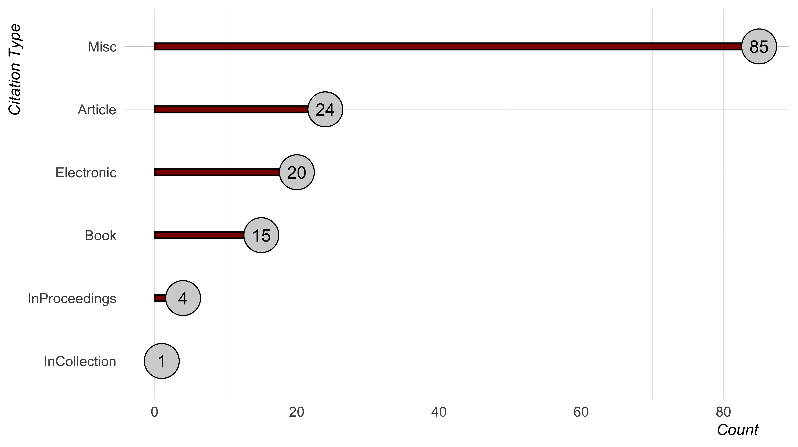
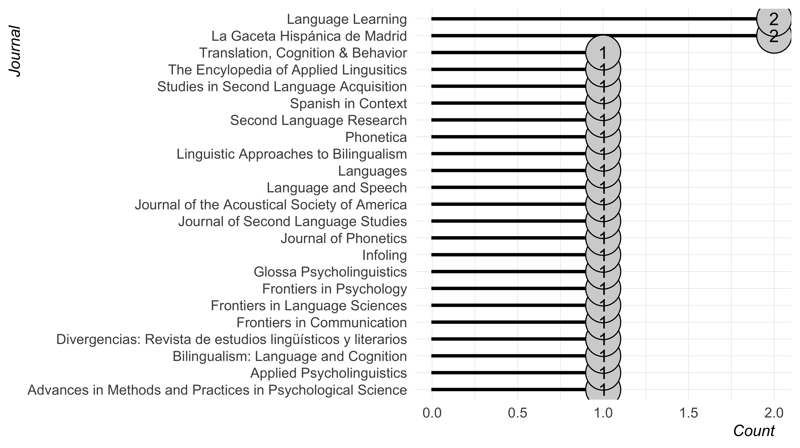
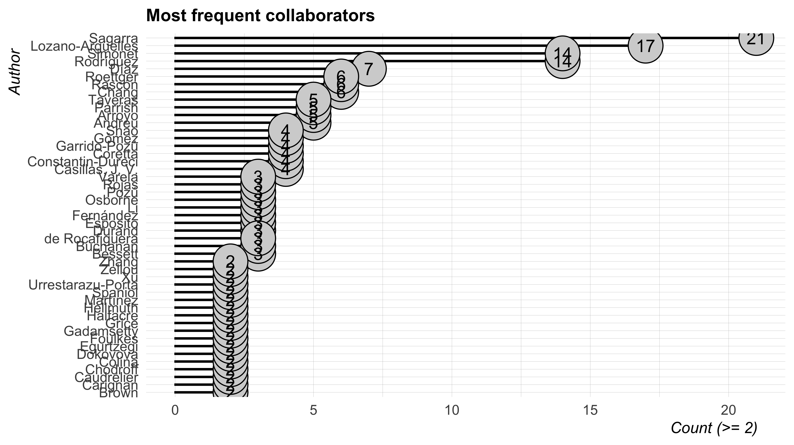
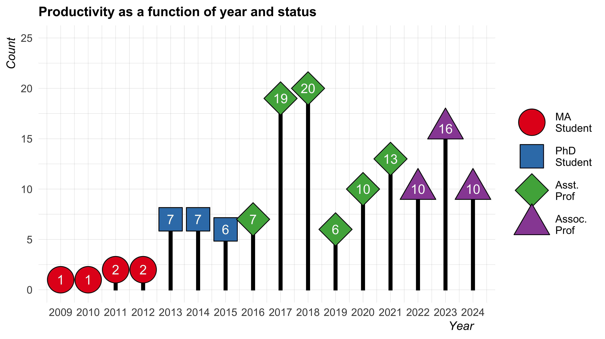
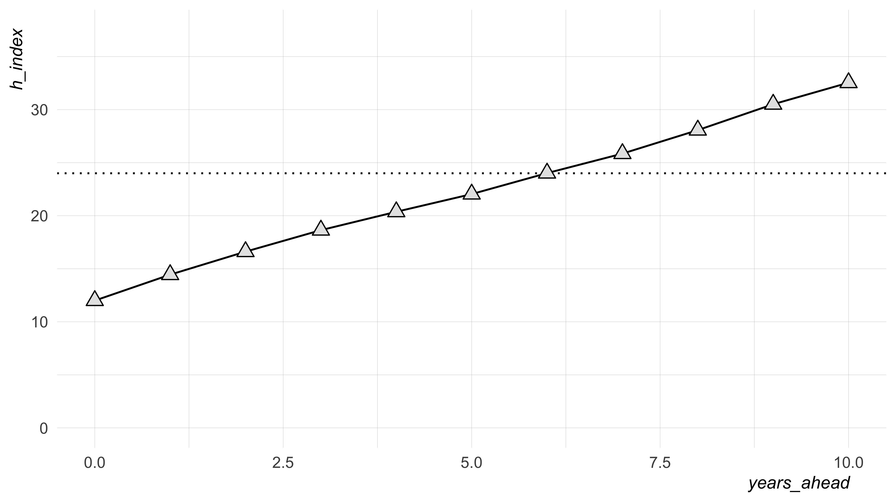
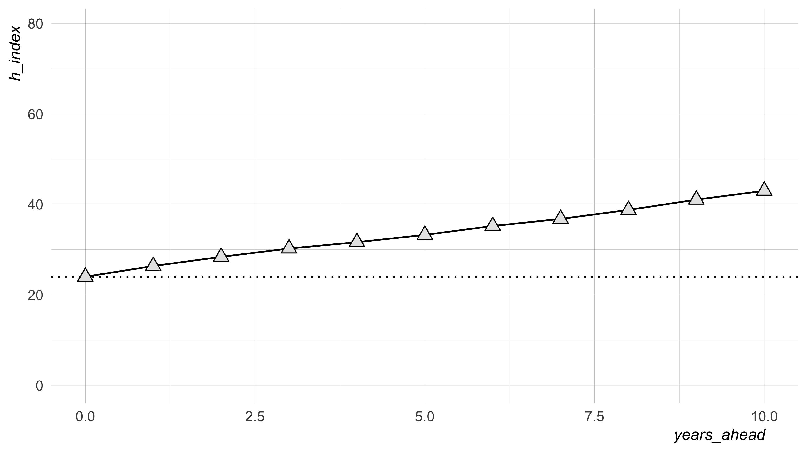
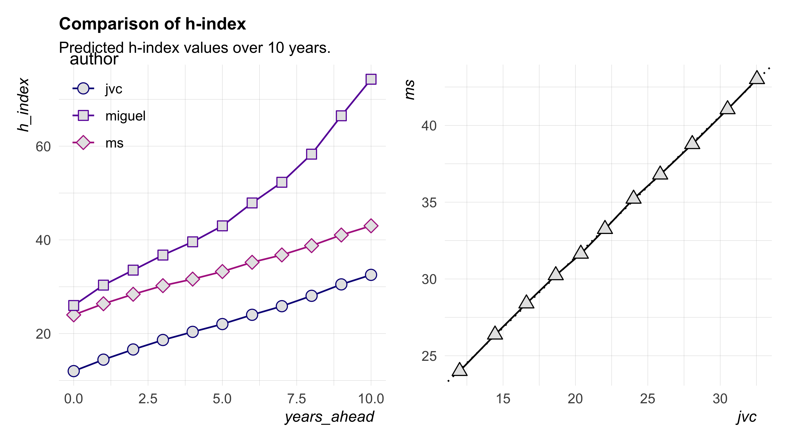
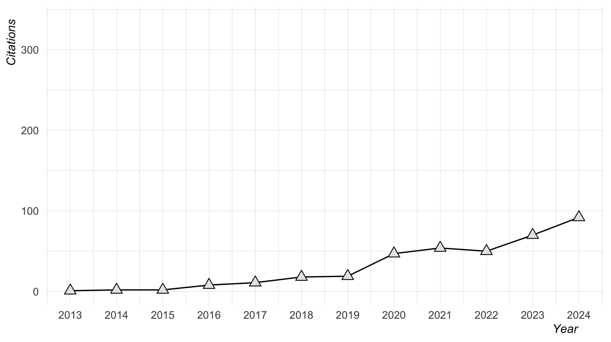
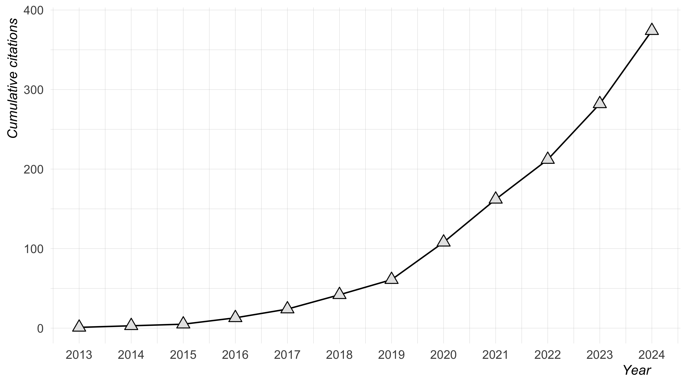
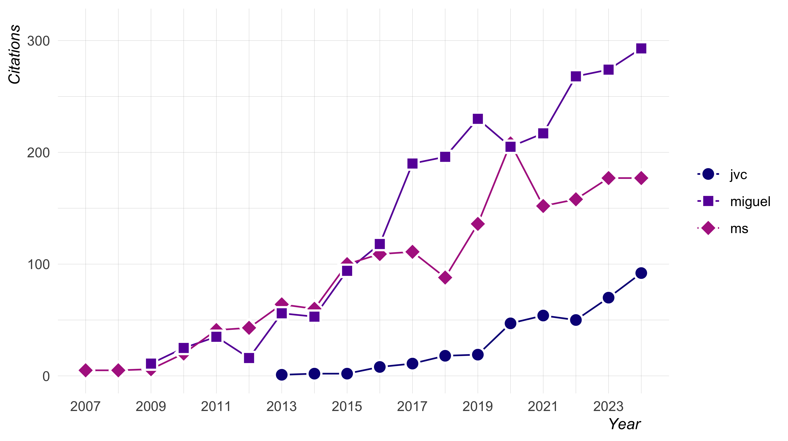

# mybib

**Last Updated**: 2024-12-20 14:28:00.28061  
**License**: Public Domain (CC-0)

Version controlled .bib files for my scholarly work, as well as some
light analyses and a complete reference list.

This repo now includes two main bib files: **publications_html.bib** and
**publications_latex.bib**.

I call these files in to other projects (e.g., cv, personal website)
when I want to print a list of references.

Initial commit is a direct copy of example done by
[leeper](https://github.com/leeper/references).

------------------------------------------------------------------------

Load bibs and generate some useful files and dataframes:

``` r
# Load bib
bib <- suppressWarnings(
  ReadBib(
    here("publications_html.bib"), 
    check = FALSE
  )
)

# Create csv of citekeys
cite_key_list <- bind_cols(
  bib$key |> unlist() |> tibble::enframe(name = NULL), 
  bib$bibtype |> unlist() |> tibble::enframe(name = NULL), 
  bib$year |> unlist() |> tibble::enframe(name = NULL)
  ) |> 
  rename(citekey = value...1, type = value...2, year = value...3) |> 
  write_csv(here("cite_key_list.csv"))

# Set bib options for printing
BibOptions(
  bib.style = "authoryear", 
  style = "text", 
  max.names = 10, 
  first.inits = TRUE, 
  check.entries = FALSE
)

# Convert to dataframe for analyses
dat <- bib |> 
  as_tibble() |> 
  map_df(.f = HTMLdecode) |> 
  mutate(year = as.numeric(year))
```

And now some basic statistics on its contents:

## Citation Types

``` r
counts <- xtabs(~bibtype, data = bib) |> as_tibble()

counts |> 
  mutate(bibtype = fct_reorder(bibtype, n)) |> 
  ggplot() + 
  aes(x = bibtype, y = n, label = n) + 
  geom_bar(stat = 'identity', color = 'black', fill = 'darkred', width = 0.1) +
  geom_point(pch = 21, size = 10, color = 'black', fill = 'lightgrey') + 
  geom_text() + 
  labs(y = "Count", x = "Citation Type") + 
  coord_flip() + 
  my_theme()
```



## Journals

``` r
datj <- aggregate(bibtype ~ journal, data = bib, FUN = length)

dat |> 
  group_by(journal) |> 
  summarize(counts = n(), .groups = "drop") |> 
  na.omit() |> 
  mutate(journal = fct_reorder(journal, counts)) |> 
  ggplot() + 
  aes(x = journal, y = counts, label = counts) + 
  geom_bar(stat = "identity", color = 'black', fill = 'darkred', width = 0.1) +
  geom_point(pch = 21, size = 10, color = 'black', fill = 'lightgrey') + 
  geom_text() + 
  labs(y = "Count", x = "Journal") + 
  coord_flip() + 
  my_theme()
```



## Authors

``` r
# Initialize list
authors <- list()

# For each element in list, get last name of author and store in 
# 'authors' list
for (i in 1:length(bib)) {
  authors[[i]] <- bib[i]$author$family |> unlist()
}

# Convert to tibble and plot
map(authors, HTMLdecode) |> 
  unlist() |>
  enframe() |> 
  group_by(value) |> 
  summarize(counts = n(), .groups = "drop") |> 
  mutate(value = fct_reorder(value, counts)) |> 
  filter(counts >= 2, value != "Casillas") |> 
  ggplot() + 
  aes(x = value, y = counts, label = counts) + 
  geom_bar(stat = "identity", color = 'black', fill = 'darkred', width = 0.1) +
  geom_point(pch = 21, size = 10, color = 'black', fill = 'lightgrey') + 
  geom_text() + 
  labs(y = "Count (>= 2)", x = "Author", 
       title = "Most frequent collaborators") + 
  coord_flip() + 
  my_theme()
```



## Publication Years

``` r
prod <- dat |> 
  select(year) |> 
  na.omit() |> 
  group_by(year) |> 
  summarize(counts = n(), .groups = "drop") |> 
  ungroup() |> 
  mutate(
    status = case_when(
        year <= 2012               ~ "MA\nStudent", 
        year >  2012 & year < 2016 ~ "PhD\nStudent", 
        year >= 2016 & year < 2022 ~ "Asst.\nProf", 
        year >= 2022               ~ "Assoc.\nProf"
      ),
    status = fct_relevel(status,  c('MA\nStudent', 'PhD\nStudent', 'Asst.\nProf'))
  )

year_max <- max(prod$counts)
year_current <- prod$year |> unique() |> max()

prod |> 
  ggplot() + 
  aes(x = year, y = counts, label = counts) + 
  geom_bar(stat = "identity", color = 'black', fill = 'black', width = 0.1) +
  geom_point(aes(shape = status, fill = status), size = 10, color = 'black') + 
  scale_shape_manual(name = '', values = 21:24) + 
  scale_x_continuous(breaks = seq(2009, year_current, 1)) + 
  geom_text(color = 'white') + 
  scale_fill_brewer(name = '', palette = 'Set1') + 
  labs(y = "Count", x = "Year", 
       title = "Productivity as a function of year and status") + 
  expand_limits(y = c(0, year_max + 5)) + 
  my_theme()
```



# Google scholar data

## H-index stuff

``` r
# Include ID
my_id <- "6sd7cVAAAAAJ"
ms_id <- "GnYMTI8AAAAJ"
miguel <- "12mgD38AAAAJ"

ids <- c(my_id, ms_id)
# compare_scholars(ids)
# compare_scholar_careers(ids)

# Get h-index and citation history
predict_h_index <- function(id, journals = NULL) {
    id <- tidy_id(id)

    # Getting the h-index and checking for NA
    h <- get_profile(id)$h_index
    if (is.na(h)) return(NA)

    n <- get_num_articles(id) # number of articles written
    y <- as.numeric(format(Sys.Date(), "%Y")) - get_oldest_article(id)
    j <- get_num_distinct_journals(id)

    # Handle optional journals parameter
    if (is.null(journals)) {
        q <- get_num_top_journals(id)
    } else {
        q <- get_num_top_journals(id, journals)
    }

    # Regression coefficients
    coefs <- c(
        1, 0.760, 0.373, 0.967, -0.069, 0.018, 0.033,
        2, 1.413, 0.781, 0.936, -0.132, 0.018, 0.064,
        3, 2.227, 1.105, 0.903, -0.193, 0.027, 0.096,
        4, 3.196, 1.386, 0.871, -0.274, 0.039, 0.145,
        5, 3.997, 1.578, 0.858, -0.345, 0.063, 0.198,
        6, 4.752, 1.671, 0.817, -0.377, 0.117, 0.282,
        7, 5.741, 1.761, 0.761, -0.420, 0.170, 0.394,
        8, 6.531, 1.796, 0.669, -0.420, 0.252, 0.508,
        9, 7.482, 1.653, 0.561, -0.415, 0.383, 0.629,
        10, 8.734, 1.326, 0.478, -0.411, 0.522, 0.823
    )
    coefs.m <- matrix(coefs, nrow=10, byrow=TRUE)
    coefs <- coefs.m[,-1]
    vals <- c(1, sqrt(n), h, y, j, q)

    # Calculate the h-index predictions
    h.pred <- coefs %*% vals
    h.vals <- c(h, h.pred)

    # Check for sensible values
    standard.warning <- "You're probably not a neuroscientist. Please read the documentation for information on the limitations of this function."
  
    if (any(diff(h.vals) < 0)) {
        warning(paste0("Decreasing h-values predicted. ", standard.warning))
    }

    if (any(h.vals < 0)) {
        warning(paste0("Negative h-values predicted. ", standard.warning))
    }
  
    return(data.frame(years_ahead = 0:10, h_index = h.vals))
}

my_h <- predict_h_index(my_id) |> mutate(author = "jvc")
my_c <- get_citation_history(my_id) |> mutate(author = "jvc")

# Game same info for MS
ms_h <- predict_h_index(ms_id) |> mutate(author = "ms")
ms_c <- get_citation_history(ms_id) |> mutate(author = "ms")

mj_h <- predict_h_index(miguel) |> mutate(author = "miguel")
mj_c <- get_citation_history(miguel) |> mutate(author = "miguel")
```

My current h-index is 12. I don’t really know what this means (yet), but
I can predict how this will grow over the next ten years.

``` r
my_h |> 
  ggplot() + 
  aes(x = years_ahead, y = h_index) + 
  geom_hline(yintercept = ms_h[1, 2], lty = 3) + 
  geom_path() + 
  geom_point(pch = 24, fill = "grey90", size = 3) + 
  ylim(0, max(my_h$h_index) + 5) + 
  my_theme()
```



``` r
ms_h |> 
  ggplot() + 
  aes(x = years_ahead, y = h_index) + 
  geom_hline(yintercept = ms_h[1, 2], lty = 3) + 
  geom_path() + 
  geom_point(pch = 24, fill = "grey90", size = 3) + 
  ylim(0, max(mj_h$h_index) + 5) + 
  my_theme()
```



So it looks like I can plan on my h-index improving, but I have no
context (yet) for what this means. I would like to add a few influential
people to the plot to see where I currently fit in in relation to them.
This might be a useful metric for setting goals.

``` r
# Plot h-index side by side
h_index_1 <- bind_rows(my_h, ms_h, mj_h) |> 
  ggplot() + 
  aes(x = years_ahead, y = h_index, shape = author, color = author) + 
  geom_path() + 
  geom_point(fill = "grey90", size = 3) + 
  scale_color_viridis_d(option = "C", end = 0.4) + 
  scale_shape_manual(values = 21:23) + 
  labs(title = "Comparison of h-index", 
       subtitle = "Predicted h-index values over 10 years.") + 
  my_theme() + 
  theme(legend.position = "inside", legend.position.inside = c(0.15, 0.88))

# Fit a model and plot trajectories
combined_h <- bind_rows(my_h, ms_h) |> 
  pivot_wider(names_from = author, values_from = h_index)
coefs <- lm(ms ~ jvc, data = combined_h) |> coef()

h_index_2 <- combined_h |> 
  ggplot() + 
  aes(x = jvc, y = ms) + 
  geom_abline(intercept = coefs[1], slope = coefs[2], lty = 3) + 
  geom_path() + 
  geom_point(pch = 24, fill = "grey90", size = 3) + 
  my_theme()

h_index_1 + h_index_2
```



So it looks like MS has an overall higher h-index and the function shows
us as having more or less similar growth over time.

## Citations

Now I will take a look at my citation history.

``` r
my_c |> 
  ggplot() + 
  aes(x = year, y = cites) + 
  geom_path() + 
  geom_point(pch = 24, fill = "grey90", size = 3) + 
  scale_x_continuous(breaks = seq(min(my_c$year), max(my_c$year), 1)) + 
  coord_cartesian(ylim = c(0, 0.9 * sum(my_c$cites))) + 
  labs(y = "Citations", x = "Year") + 
  my_theme()
```



``` r
my_c |> 
  mutate(cum = cumsum(cites)) |> 
  ggplot() + 
  aes(x = year, y = cum) + 
  geom_path() + 
  geom_point(pch = 24, fill = "grey90", size = 3) + 
  scale_x_continuous(breaks = seq(min(my_c$year), max(my_c$year), 1)) + 
  coord_cartesian(ylim = c(0, sum(my_c$cites) + 10)) + 
  labs(y = "Cumulative citations", x = "Year") + 
  my_theme()
```



Note that these are cumulative citations by year.

Let’s plot this in comparison to MS.

``` r
bind_rows(my_c, ms_c, mj_c) |> 
  ggplot() + 
  aes(x = year, y = cites, shape = author, color = author) + 
  geom_path() + 
  geom_point(aes(fill = author), size = 3.5, color = "white", stroke = 1) + 
  scale_shape_manual(name = NULL, values = 21:23) + 
  scale_color_viridis_d(name = NULL, option = "C", end = 0.4) + 
  scale_fill_viridis_d(name = NULL, option = "C", end = 0.4) + 
  scale_x_continuous(breaks = seq(min(ms_c$year), max(my_c$year), 2)) + 
  coord_cartesian(ylim = c(0, max(mj_c$cites) + 20)) + 
  labs(y = "Citations", x = "Year") + 
  my_theme()
```



Both MS and I had bumps in year 5, but they aren’t even remotely
comparable. 😳

------------------------------------------------------------------------

# Journals

## Already published or accepted

- Journal of Second Language Studies
- Second Language Research
- Phonetica
- Journal of the Acoustical Society of America
- Journal of Phonetics
- Bilingualism: Language and Cognition
- Language and Speech
- Language Learning
- Studies in SLA
- Spanish in Context
- Languages
- Translation, Cognition & Behavior
- Advances in Methods and Practices in Psychological Science
- Frontiers in Psychology
- Frontiers in Communication
- Applied Psycholinguistics
- Frontiers in Psychology
- Linguistic approaches to bilingualism

## Submitted

- International Journal of Bilingualism
- Linguistics: An Interdisciplinary Journal of the Language Sciences

## In prep

- JASA

## On deck

- Journal of Second Language Pronunciation

## Wishlist

- Heritage Language Journal
- Laboratory phonology

------------------------------------------------------------------------

# My references (testing)

## Articles

``` r
# Printer function for refs
ref_printer <- function(pubs) {
  
  for (i in pubs) {
    print(bib[key = i]); cat("\n")
  }
  
}
```

``` r
# Filter citekey dataframe, convert to vector and use to subset bib
filter(cite_key_list, type == "Article") |> 
  arrange(desc(year)) |> 
  pull(citekey) |> 
  ref_printer()
```

Coretta, S. and J. V. Casillas (2024). “A tutorial on generalised
additive mixed effects models for bilingualism research”. In:
*Linguistic Approaches to Bilingualism*, pp. 1-24. DOI:
10.1075/lab.23076.cor.

Sagarra, N., L. Fernández, C. Lozano-Argüelles, and J. V. Casillas
(2024). “Unraveling the Complexities of Second Language Lexical Stress
Processing: The Impact of First Language Transfer, Second Language
Proficiency, and Exposure”. In: *Language Learning* 74 (3), pp. 574-605.
DOI: 10.1111/lang.12627.

Bochynska, A., L. Keeble, C. Halfacre, J. V. Casillas, I. Champagne, K.
Chen, M. Röthlisberger, E. M. Buchanan, and T. B. Roettger (2023).
“Reproducible research practices and transparency across Linguistics”.
In: *Glossa Psycholinguistics* 2 (1), pp. 1-36. DOI: 10.5070/G6011239.

Sagarra, N. and J. V. Casillas (2023). “Practice beats age:
Co-activation shapes heritage speakers’ lexical access more than age of
onset”. In: *Frontiers in Psychology* 14, pp. 1-18. DOI:
10.3389/fpsyg.2023.1141174.

Lozano-Argüelles, C., N. Sagarra, and J. V. Casillas (2023).
“Interpreting experience and working memory effects on L1 and L2
morphological prediction”. In: *Frontiers in Language Sciences* 1, pp.
1-16. DOI: 10.3389/flang.2022.1065014.

Coretta, S., J. V. Casillas, S. Roessig, M. Franke, B. Ahn, A. H.
Al-Hoorie, J. Al-Tamimi, N. E. Alotaibi, M. K. AlShakhori, R. M.
Altmiller, et al. (2023). “Multidimensional Signals and Analytic
Flexibility: Estimating Degrees of Freedom in Human-Speech Analyses”.
In: *Advances in Methods and Practices in Psychological Science* 6.3,
pp. 1-29. DOI: 10.1177/25152459231162567.

Casillas, J. V., J. J. Garrido-Pozú, K. Parrish, L. Fernández Arroyo, N.
Rodríguez, R. Esposito, I. Chang, K. Gómez, G. Constantin-Dureci, J.
Shao, et al. (2023). “Using intonation to disambiguate meaning: The role
of empathy and proficiency in L2 perceptual development”. In: *Applied
Psycholinguistics* 44.5, pp. 913-940. DOI: 10.1017/S0142716423000310.

Carignan, C., J. V. Casillas, E. Chodroff, and G. Zellou (2022).
“Editorial: Fuzzy boundaries: Ambiguity in speech production and
comprehension”. In: *Frontiers in Communication* 7, pp. 1-3. DOI:
10.3389/fcomm.2022.1112753.

Jiménez-Crespo, M. and J. V. Casillas (2021). “Literal is not always
easier: Literal and default translation, post-editing effort, and
comparable corpora”. In: *Translation, Cognition & Behavior* 4.1, pp.
98-123. DOI: https://doi.org/10.1075/tcb.00048.jim.

Casillas, J. V. (2021). “Interlingual Interactions Elicit Performance
Mismatches Not ‘Compromise’ Categories in Early Bilinguals: Evidence
from Meta-Analysis and Coronal Stops”. In: *Languages* 6.9, pp. 1-20.
DOI: https://doi.org/10.3390/languages6010009.

Lozano-Argüelles, C., L. F. Arroyo, N. Rodríguez, E. Durand, J. J. G.
Pozú, J. M. Rojas, J. Varela, N. de Rocafiguera, and J. V. Casillas
(2021). “Conceptually cued perceptual categorization in adult L2
learners”. In: *Studies in Second Language Acquisition* 43.1, pp.
204-219. DOI: https://doi.org/10.1017/S0272263120000273.

Casillas, J. V. (2020). “The longitudinal development of fine-phonetic
detail: Stop production in a domestic immersion program”. In: *Language
Learning* 70.3, pp. 768-806. DOI:
https://doi.org/https://doi.org/10.1111/lang.12392.

Casillas, J. V. (2020). “Phonetic category formation is perceptually
driven during the early stages of adult L2 development”. In: *Language
and Speech* 63.3, pp. 550-581. DOI:
https://doi.org/10.1177/0023830919866225.

Lozano-Argüelles, C., N. Sagarra, and J. V. Casillas (2020). “Slowly but
surely: Interpreting facilitates L2 morphological anticipation based on
suprasegmental and segmental information”. In: *Bilingualism: Language
and Cognition* 23.4, pp. 752-762. DOI:
https://doi.org/10.1017/S1366728919000634.

Casillas, J. V. and M. Simonet (2018). “Perceptual categorization and
bilingual language modes: Assessing the double phonemic boundary in
early and late bilinguals”. In: *Journal of Phonetics* 71, pp. 51-64.
DOI: https://doi.org/10.1016/j.wocn.2018.07.002.

Sagarra, N. and J. V. Casillas (2018). “Suprasegmental information cues
morphological anticipation during L1/L2 lexical access”. In: *Journal of
Second Language Studies* 1.1, pp. 31-59. DOI:
https://doi.org/10.1075/jsls.17026.sag.

Bessett, R. M., J. V. Casillas, and M. Ramírez Martínez (2017).
“Language choice and accommodation: Casual encounters in San Ysidro and
Nogales”. In: *Spanish in Context* 14.1, pp. 78-98. DOI:
https://doi.org/10.1075/sic.14.1.04bes.

Casillas, J. V. (2017). “Reseña de Lacorte, Manel. 2014. The Routledge
Handbook of Hispanic Applied Linguistics. New York: Routledge.” In:
*Infoling* 2.43. <http://infoling.org/informacion/Review230.htm>.

Llompart, M. and J. V. Casillas (2016). “Lexically driven selective
adaptation by ambiguous auditory stimuli occurs after limited exposure
to adaptors”. In: *Journal of the Acoustical Society of America* 139.5,
pp. EL172-EL177. DOI: https://doi.org/10.1121/1.4951704.

Casillas, J. V. and M. Simonet (2016). “Production and perception of the
English /æ/-/ɑ/ contrast in switched-dominance speakers”. In: *Second
Language Research* 32.2, pp. 171-195. DOI:
https://doi.org/10.1177/0267658315608912.

Casillas, J. V. (2015). “Production and perception of the /i/-/ɪ/ vowel
contrast: The case of L2-dominant early learners of English”. In:
*Phonetica* 72.2-3, pp. 182-205. DOI: https://doi.org/10.1159/000431101.

Casillas, J. V. (2012). “La fricativización del africado /tʃ/ en el
habla de las mujeres del sur de Arizona”. In: *Divergencias: Revista de
estudios lingüísticos y literarios* 10.1, pp. 56-70.

Casillas, J. V. (2010). “La vibrante múltiple intervocálica: los
ejercicios de canto como ayuda a su pronunciación en español”. In: *La
Gaceta Hispánica de Madrid* VIII. ISSN: 1886-1741.

Casillas, J. V. (2009). “El uso de los refranes en El Quijote”. In: *La
Gaceta Hispánica de Madrid* VIII. ISSN: 1886-1741.
